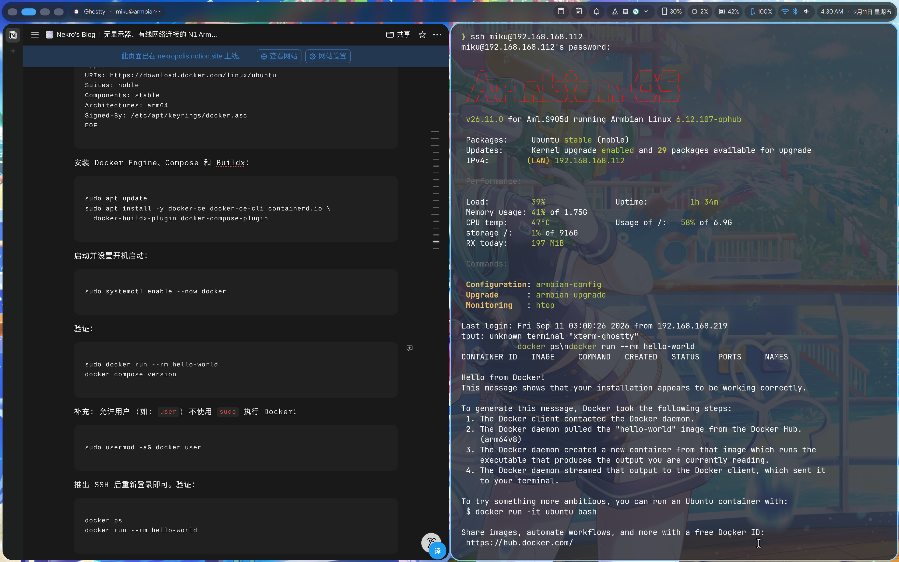
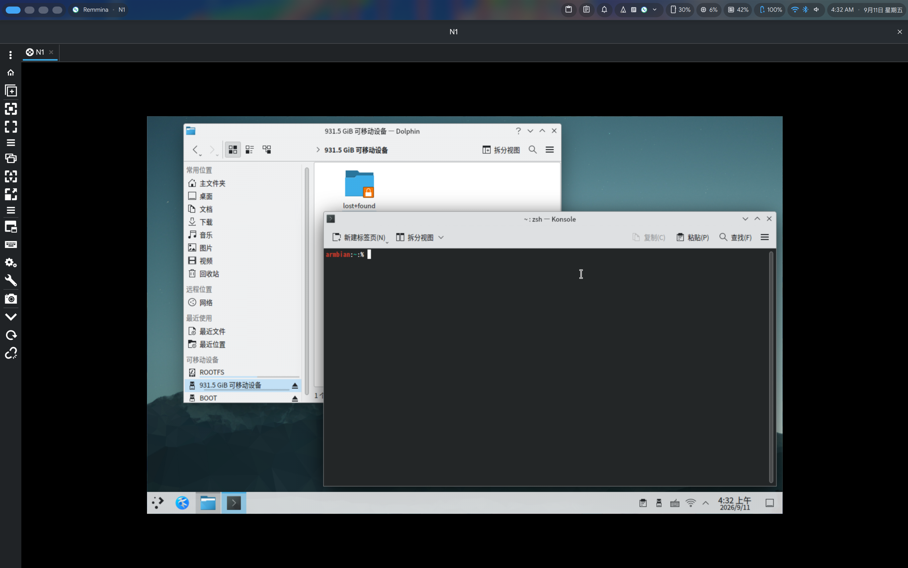
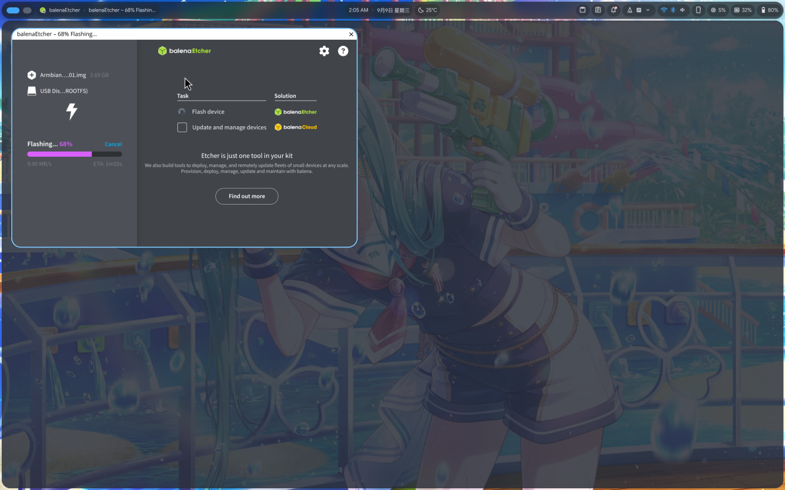
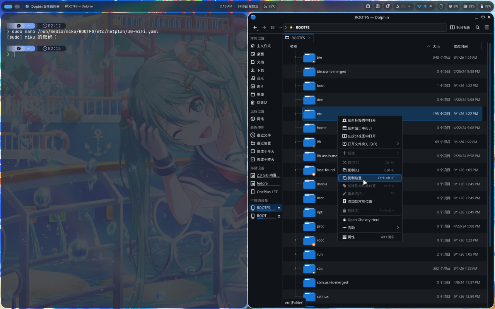
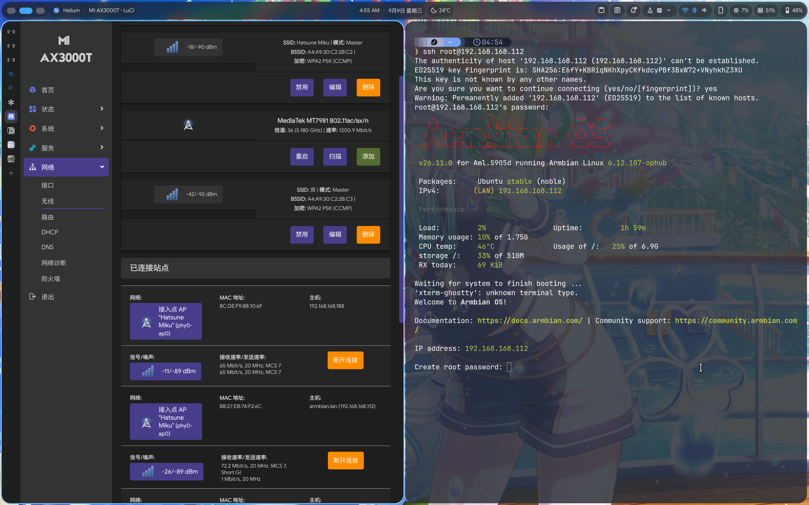
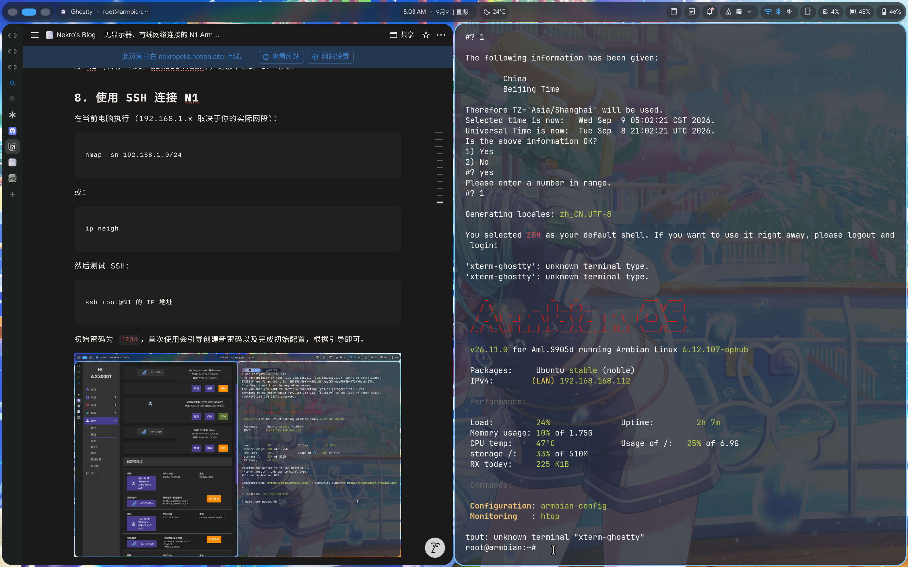

# 前言

马上开学了，我打算转变一下 N1 在我这里的实际用途。iStoreOS 核心仍然是一个路由系统，虽说它也具有 Docker 与 Ubuntu 模拟器等功能，但在没有有线网络连接的情况下，它的使用体验说不上好，因此我决定迁移到其它系统。

迁移过程中，恰好碰到了显示器故障，我需要在尽可能少依靠外部设备的情况下安装一个新的系统。最终我选择了目前较为成熟的 Armbian。与现在比较流行的 fnOS 不同，它的好处在于我不一定要将固件写入 emmc，只要有办法启动，那么可以避免覆盖内置 eMMC 中的 Android，并减少反复刷写 eMMC 带来的风险；后续更换系统时只需更换或重新烧录 USB 系统盘。

# 准备工作

1. 一台 Linux 电脑 + 一个 USB 2.0 U 盘 (或 Windows 电脑 + 两个 U 盘)。
2. 运行可在启动阶段切换 USB 启动的斐讯 N1 (此前文章 的 ATV 便符合这个条件 其余系统请自行测试)，若运行原厂系统可能仍需借助显示器进行。
3. 2.4 GHz WPA2 无线网络、ASCII SSID。其他网络环境（5 GHz、中文 SSID、WPA3、802.1X/校园认证）未经验证，经测试在同时使用 5 Ghz WiFi 与中文 SSID 时明确出现了连接问题，建议首次配置时先使用简单网络。

# 结果展示






# 具体步骤

## 1. 下载镜像与烧录

从 GitHub Releases 下载最新的 Armbian 稳定版镜像到电脑 (这里附 26.09 的链接) 并解压出 .img。通过 balenaEtcher 将镜像烧录到 U 盘。



## 2. 准备 Linux 环境

如果你的电脑正在运行 Linux，可以跳过这一步骤。否则你需要创建一个任意发行版的 LiveCD 并启动，并在第四步以及后续步骤使用。

## 3. 刷入修改后的 Android 固件

如果你的固件支持在启动阶段通过 U 盘启动，那么也可以跳过当前步骤。否则请先按 先前文章 的指导刷入可用的 ATV 固件。

## 4. 挂载 ROOTFS

将烧录好 Armbian 固件的 U 盘连接电脑，使用文件管理器确定 /ROOTFS/etc 文件夹的地址，复制用于后续替换。一般来说文件会自动挂载，如果没有挂载，尝试执行以下命令 (目录根据实际情况自行替换)。



终端执行：

```
udisksctl mount -b /dev/disk/by-label/ROOTFS
```

确认挂载点：

```
findmnt /run/media/用户名/ROOTFS
```

应显示 `rw`。如果是 `ro`，先卸载后重新挂载。

## 5. 创建 Netplan 配置

普通用户可能无法通过文件管理在文件夹内创建文件或更改权限，因此这里需要使用终端操作。

终端执行：

```
sudo nano /run/media/miku/ROOTFS/etc/netplan/30-wifi.yaml
```

写入：

```
network:
  version: 2
  renderer: NetworkManager
  wifis:
    any-wifi:
      match:
        name: "wl*"
      dhcp4: true
      dhcp6: false
      regulatory-domain: CN
      access-points:
        "你的WiFi名称":
          password: "你的WiFi密码"
```

- `name: "wl*"` 会匹配 `wlan0` 等无线网卡名称，比直接写死 `wlan0` 更稳妥。

保存：

```
Ctrl+O
回车
Ctrl+X
```

## 6. 设置权限

终端执行：

```
sudo chown root:root /run/media/miku/ROOTFS/etc/netplan/30-wifi.yaml
sudo chmod 600 /run/media/miku/ROOTFS/etc/netplan/30-wifi.yaml
```

检查 YAML 文件：

```
sudo cat /run/media/miku/ROOTFS/etc/netplan/30-wifi.yaml
```

## 7. 卸载并启动 N1

弹出 U 盘，将其插回 N1 启动。NetworkManager 便会在启动时读取该 Netplan 文件并通过 DHCP 获取地址。等待 2-5 分钟后，若一切顺利，你就可以在路由器的设备列表发现 N1 (名称一般是 armbian.lan)，记录下它的 IP 地址。

## 8. 使用 SSH 连接 N1

在当前电脑执行 (192.168.1.x 取决于当前实际网段)：

```
nmap -sn 192.168.1.0/24
```

或：

```
ip neigh
```

然后测试 SSH：

```
ssh root@N1 的 IP 地址
```

初始密码为 `1234`，首次使用会引导创建新密码以及完成初始配置，根据引导即可。



完成配置。后续使用新的用户名 (如图 miku) 进行 ssh 登录。



为新用户设置管理员权限，SSH 登录 root 后执行：

```
sudo usermod -aG sudo 新用户名
```

## 9. 图形界面安装与使用

在 Linux 环境下，推荐使用 `Remmina` 连接和控制设备。若使用 Windows 或是移动设备，也可以使用远程桌面连接 (`Windows App`) 尝试连接。具体步骤如下：

SSH 登录后，终端执行：

```
sudo apt update
sudo apt install kde-plasma-desktop xrdp xorgxrdp kwin-x11
```

安装时间较长，耐心等待完成即可。kde-plasma-desktop 可以换成其它的桌面管理器 (如 XFCE、LXQt)。

设置 KDE 会话：

```
nano ~/.xsession
```

写入：

```
#!/bin/sh
export XDG_SESSION_TYPE=x11
export XDG_CURRENT_DESKTOP=KDE
export XDG_SESSION_DESKTOP=KDE
export KDE_FULL_SESSION=true
export QT_X11_NO_MITSHM=1
export QT_QPA_PLATFORM=xcb

dbus-update-activation-environment --systemd \
  DISPLAY XAUTHORITY XDG_SESSION_TYPE \
  XDG_CURRENT_DESKTOP XDG_SESSION_DESKTOP \
  KDE_FULL_SESSION QT_X11_NO_MITSHM QT_QPA_PLATFORM \
  2>/dev/null || true

exec dbus-run-session -- startplasma-x11
```

然后：

```
chmod +x ~/.xsession
sudo systemctl enable --now xrdp
sudo ss -lntp | grep 3389
```

看到 `0.0.0.0:3389` 或 `[::]:3389` 后，在 Remmina 中选择：

```
协议：RDP
服务器：你的 N1 内网 IP:3389
用户名：你的实际用户名
```

如果 `3389` 没有监听，执行：

```
sudo systemctl status xrdp --no-pager
```

后续若需连接显示器，可以安装 `sddm`：

```
sudo apt install sddm
```

# 体验优化

## 终端识别问题

在当前设备指定即可：

```
export TERM=xterm-256color
```

## 中文字体安装

```
sudo apt update
sudo apt install fonts-noto-cjk language-pack-zh-hans language-pack-zh-hans-base
sudo fc-cache -f -v
```

## **安装 Dolphin 文件管理器**

```
sudo apt update
sudo apt install dolphin kio-extras ffmpegthumbs
```

## 安装网络配置工具

```
sudo apt install network-manager plasma-nm
```

## **安装 Docker 并设置权限**

终端执行：

```
sudo apt update
sudo apt install -y ca-certificates curl
```

添加 Docker 官方软件源：

```
sudo install -m 0755 -d /etc/apt/keyrings
sudo curl -fsSL https://download.docker.com/linux/ubuntu/gpg \
  -o /etc/apt/keyrings/docker.asc
sudo chmod a+r /etc/apt/keyrings/docker.asc
```

```
sudo tee /etc/apt/sources.list.d/docker.sources >/dev/null <<EOF
Types: deb
URIs: https://download.docker.com/linux/ubuntu
Suites: noble
Components: stable
Architectures: arm64
Signed-By: /etc/apt/keyrings/docker.asc
EOF
```

安装 Docker Engine、Compose 和 Buildx：

```
sudo apt update
sudo apt install -y docker-ce docker-ce-cli containerd.io \
  docker-buildx-plugin docker-compose-plugin
```

启动并设置开机启动：

```
sudo systemctl enable --now docker
```

验证：

```
sudo docker run --rm hello-world
docker compose version
```

注意：`docker` 用户组拥有近似 root 的权限；另外 Docker 发布的容器端口可能绕过 UFW 规则。
